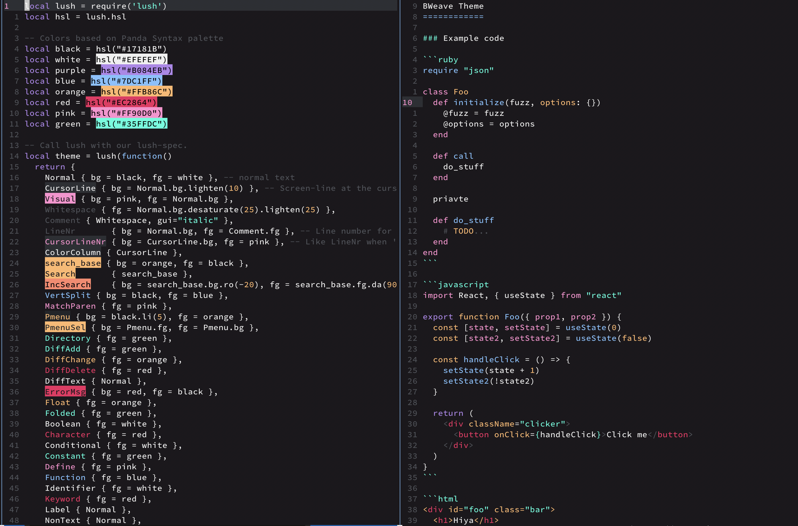

My Neovim theme
===

A Lush Theme for Neovim inspired by [Panda Syntax](http://panda.siamak.me/).

See: http://git.io/lush.nvim for more information on Lush and a helper script
to setup your repo clone.
